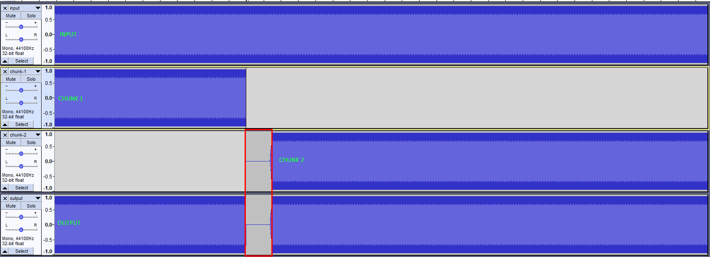

# ffmpeg-seek-bug

```bash
# Convert the first 5 seconds of audio
ffmpeg -y -ss 0 -t 5 -i input.mp3 -codec:a flac chunk-1.flac

# Convert the next 5 seconds of audio
ffmpeg -y -ss 5 -t 5 -i input.mp3 -codec:a flac chunk-2.flac

# Concatenate both chunks
ffmpeg -y -safe 0 -f concat -i input.txt -codec:a flac output.flac
```

Now play `output.flac` and you'll notice a gap between seconds 4 and 5.

In the screenshot bellow you can see the original input and the chunks as well as the final output with a gap between the two chunks.



Using [atrim](https://ffmpeg.org/ffmpeg-filters.html#atrim) instead of `-ss` and `-t` [fixes](https://www.reddit.com/r/ffmpeg/comments/hzhzbm/convert_audio_in_chunks_then_concatenate/fzkxr0c/) this problem only for the `flac` codec.

```bash
# flac codec
ffmpeg -y -i input.mp3 -af atrim=0:5 -codec:a flac chunk-1.flac
ffmpeg -y -i input.mp3 -af atrim=5:10 -codec:a flac chunk-2.flac
ffmpeg -y -safe 0 -f concat -i input-flac.txt -codec:a flac output.flac

# aac codec (or libfdk_aac)
ffmpeg -y -i input.mp3 -af atrim=0:5 -codec:a aac chunk-1.m4a
ffmpeg -y -i input.mp3 -af atrim=5:10 -codec:a aac chunk-2.m4a
ffmpeg -y -safe 0 -f concat -i input-aac.txt -codec copy output.m4a
```

No gap between the chunks when listening `output.flac` but `output.m4a` still has the same problem.